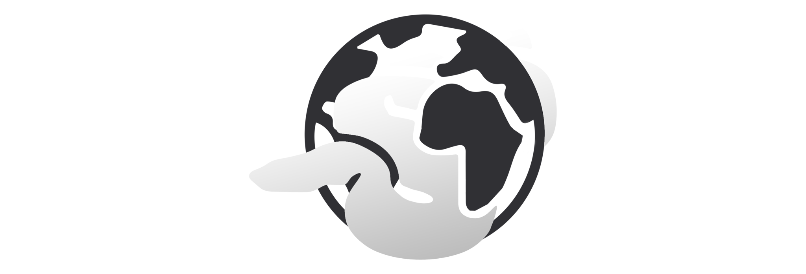

# Box-Office-Atlas :: JS/EJS/SQL Project for DAW 2024-2025
> Explore global box office film performances



----

**Box-Office-Atlas** aka "BOA" is a web-app that visualizes the global economic performance of box office films, providing users with an interactive way to explore their favourite films' success. 

**FILL OTHER INFORMATION ABOUT ARCHITECTURE HERE**

----

### Directory Navigation

| Folder 				| Description 							|
|-----------------------|---------------------------------------|
| `art`| Images and Keyart that are for the docs / repo. Non-essential to app functionality |
| `db` | All SQL files to Create, Insert and Update Tables to interface properly with the app |
| `src`| All the essential EJS, JavaScript, and CSS files for the application|

# TEMPLATE USAGE
 - Clone Repo
 - NPM init -y in the root directory to install all relevant modules
 - (OPTIONAL) Run index.js to confirm local hosting works
 - Run the SQL commands to allow DB communication
 - Enjoy


```

__/\\\\\\\\\\\\\___        _______/\\\\\______        _____/\\\\\\\\\____        
 _\/\\\/////////\\\_        _____/\\\///\\\____        ___/\\\\\\\\\\\\\__       
  _\/\\\_______\/\\\_        ___/\\\/__\///\\\__        __/\\\/////////\\\_      
   _\/\\\\\\\\\\\\\\__        __/\\\______\//\\\_        _\/\\\_______\/\\\_     
    _\/\\\/////////\\\_        _\/\\\_______\/\\\_        _\/\\\\\\\\\\\\\\\_    
     _\/\\\_______\/\\\_        _\//\\\______/\\\__        _\/\\\/////////\\\_   
      _\/\\\_______\/\\\_        __\///\\\__/\\\____        _\/\\\_______\/\\\_  
       _\/\\\\\\\\\\\\\/__        ____\///\\\\\/_____        _\/\\\_______\/\\\_ 
        _\/////////////____        ______\/////_______        _\///________\///__

```
